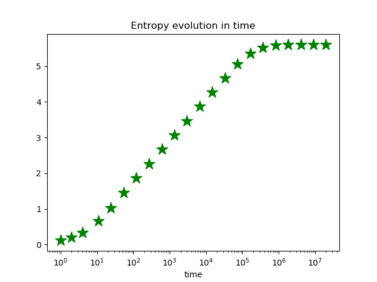

The distribution of wealth initially starts as a dirac delta function centered on 100 and then starts to spread out as a Gaussian of increasing variance.  Soon enough the left-hand-side of the distribution hits the boundary condition (no debt) at 0 whereupon it starts to accumulate.  Eventually this process converges to an exponential distribution which maximizes the entropy as can be seen in the image below.

